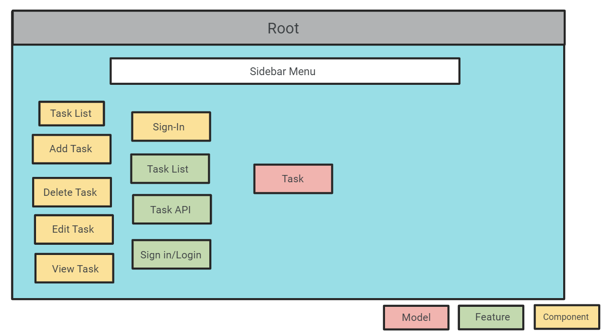
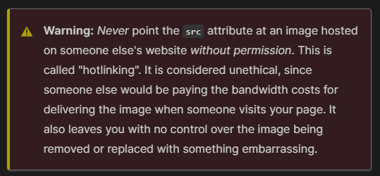
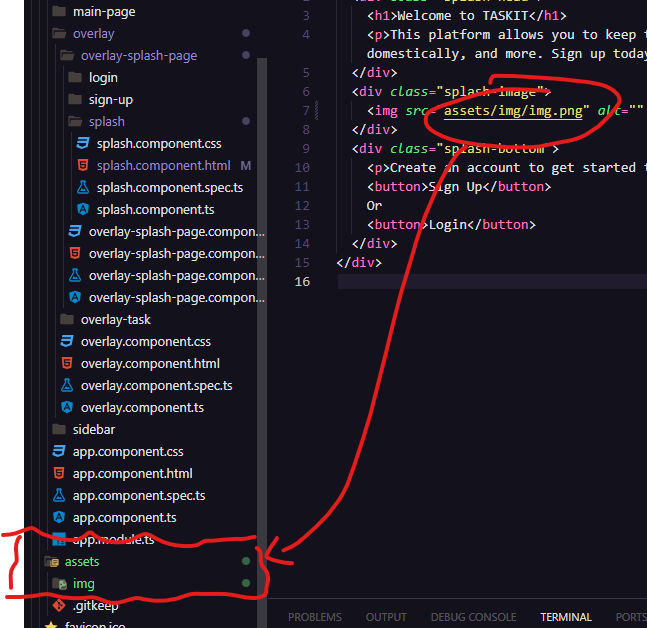

# TaskIt App

Figma Link <https://www.figma.com/file/6UcvwOSLa8OGQuQvdE1MHE/Task-Manager?type=design&node-id=5-12&mode=design>

### Battle Plan

### The Sidebar

<https://getbootstrap.com/docs/5.0/examples/sidebars/>

Nvmd borrowing, we're building this from scratch:

<https://www.youtube.com/watch?v=ZsSCHGyFeV8>

Update, it wanted me to install JQuery. Didn't really... do much

    npm install jquery

*ANOTHER update: I just had to GitBash it and it was fine!*

### Other Important Notes

Icons for Bootstrap?

    npm i bootstrap-icons

<https://icons.getbootstrap.com>

<https://www.tutorialrepublic.com/twitter-bootstrap-tutorial/bootstrap-icons.php>

I found a better version of the tutorial here

<https://www.youtube.com/watch?v=OPt87w9WuZo>

bg- <-- background colors

<https://getbootstrap.com/docs/4.0/utilities/colors/>

I found a table reference!

<https://codepen.io/RedJokingInn/pen/RpddaE>

### 10/9/23

Found instructions on how to round corners
<https://unused-css.com/blog/css-rounded-table-corners/>

### 10/10/23

Found a link to a Kanban template
<https://codepen.io/Aniboaz/pen/vKOXPa>

Sign in/create an account page
<https://codepen.io/bowie/pen/njjaZo>

Transparent Window
<https://codepen.io/jaeming/pen/XWyaMe>

### 10/11/23

Dropdown buttons
<https://getbootstrap.com/docs/4.0/components/dropdowns/>

*I'm pretty sure I can put the task lines, like we've been doing, as a template. Then I don't need to go row per row to automate them in the HTML*

### 10/12/23

<https://www.w3schools.com/howto/tryit.asp?filename=tryhow_css_login_form_modal>

I like this page better! It has the capability to do things I want...

**JUST LEARNED THIS VERY IMPORTANT THING**

### 10/13/23

Found a page that might be helpful in designing the UI interface

<https://codepen.io/aybukeceylan/pen/OJRNbZp>

*UPDATE. There is a LITERAL Assets folder. Use this for embedded images*

### 10/15/23

Getting closer to partial functionality! That Recipe app demo has everything I need to link these together...

<https://www.youtube.com/watch?v=YGCDAXFWAZo>

Found another Kanban tutorial. Try this to move panels...