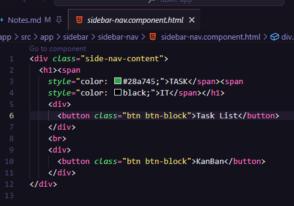
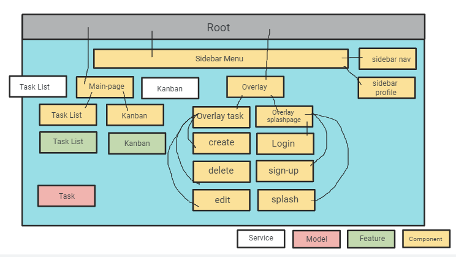

# TaskIt App

Figma Link <https://www.figma.com/file/6UcvwOSLa8OGQuQvdE1MHE/Task-Manager?type=design&node-id=5-12&mode=design>

### Battle Plan

### The Sidebar

<https://getbootstrap.com/docs/5.0/examples/sidebars/>

Nvmd borrowing, we're building this from scratch:

<https://www.youtube.com/watch?v=ZsSCHGyFeV8>

Update, it wanted me to install JQuery. Didn't really... do much

    npm install jquery

*ANOTHER update: I just had to GitBash it and it was fine!*

### Other Important Notes

Icons for Bootstrap?

    npm i bootstrap-icons

<https://icons.getbootstrap.com>

<https://www.tutorialrepublic.com/twitter-bootstrap-tutorial/bootstrap-icons.php>

I found a better version of the tutorial here

<https://www.youtube.com/watch?v=OPt87w9WuZo>

bg- <-- background colors

<https://getbootstrap.com/docs/4.0/utilities/colors/>

I found a table reference!

<https://codepen.io/RedJokingInn/pen/RpddaE>

### 10/9/23

Found instructions on how to round corners
<https://unused-css.com/blog/css-rounded-table-corners/>

### 10/10/23

Found a link to a Kanban template
<https://codepen.io/Aniboaz/pen/vKOXPa>

Sign in/create an account page
<https://codepen.io/bowie/pen/njjaZo>

Transparent Window
<https://codepen.io/jaeming/pen/XWyaMe>

### 10/11/23

Dropdown buttons
<https://getbootstrap.com/docs/4.0/components/dropdowns/>

*I'm pretty sure I can put the task lines, like we've been doing, as a template. Then I don't need to go row per row to automate them in the HTML*

### 10/12/23

<https://www.w3schools.com/howto/tryit.asp?filename=tryhow_css_login_form_modal>

I like this page better! It has the capability to do things I want...

**JUST LEARNED THIS VERY IMPORTANT THING**

### 10/13/23

Found a page that might be helpful in designing the UI interface

<https://codepen.io/aybukeceylan/pen/OJRNbZp>

*UPDATE. There is a LITERAL Assets folder. Use this for embedded images*

### 10/15/23

Getting closer to partial functionality! That Recipe app demo has everything I need to link these together...

<https://www.youtube.com/watch?v=YGCDAXFWAZo>

Found another Kanban tutorial. Try this to move panels...

### 10/16/23

Just going to stick to pure documentation... frankenstiening is becoming too much of a hassle.

<https://material.angular.io/cdk/drag-drop/api>

### 10/19/23

    npm install popper.js --save

Hope this works to get the dropdown to work...

Nope. Let's try this one

    npm install jquery --save

Nope!

At least I've got a dropdown list for the buttons now.
Going to skip this one for now and come back later...

We're going to go with change pages with routing and assemble some URLS!

I want to work on this part... to have the buttons load the different pages

Going to use this to generate the data table

<https://developer.mozilla.org/en-US/docs/Learn/Tools_and_testing/Client-side_JavaScript_frameworks/Angular_todo_list_beginning>

OKAY! I got a working add task button. Now just need to re-route the submit to "add" to the list via the submit button when making a new task...

## 10/26/23

Updated my outline for the app

<https://jamboard.google.com/d/1QW8bDa9fh_Ix0r4Ti95sI2UvzQLTzyJLdgg0V32oWnU/viewer?f=0>

Setting up routing:

1) Make a new file called "app-routing.module.ts"

2) Add the components you want to hop between

3) Add the router outlet to your app-component.html

<router-outlet></router-outlet>

*instead of header replace with sidebar*

Note to self: Need to combine the sidebar with the pages itself to make this MUCH cleaner... Did so by importing the bar into the page. That way if something is funky can go to the source

YES!! I've been scared with routing but finally got the wheels moving